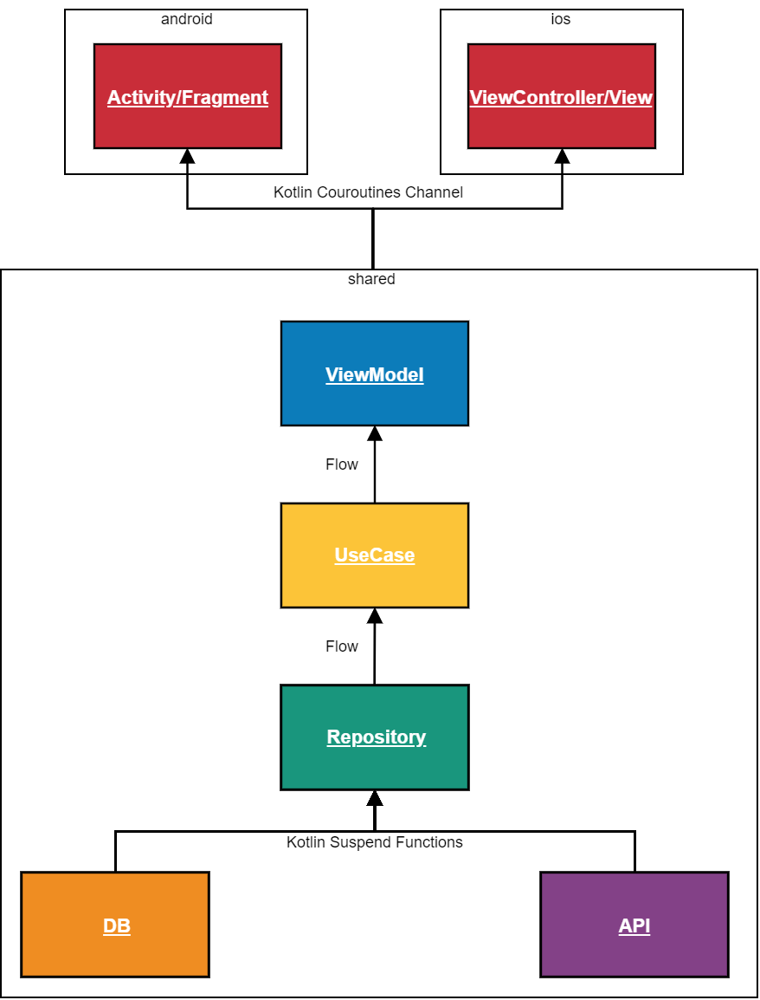

<div align="center">
  
  <p>
    <br /><strong>Projet Notre-Dame</strong>
    <br />
    <a href="https://travis-ci.org/ApplETS/Notre-Dame" style="text-decoration: none;">
        
    </a>
    <br />
  </p>
</div>

This project is the placeholder for the third version of ÉTSMobile, a mobile which application that is currently available for Android and iOS. ÉTSMobile is the main gateway between the user and the [École de technologie supérieure (ÉTS)](https://www.etsmtl.ca/) on mobile devices. ÉTSMobile is an open-source project and is developped by members of the student club [ApplETS](https://clubapplets.ca/). It offers:

* Access to evaluation grades
* Access to the student's schedules
* And many more...

_Note: This guide is also available in: [Français](https://github.com/ApplETS/Notre-Dame-v3/blob/master/README.fr.md)_

## 🤖 [Android Application](https://github.com/ApplETS/Notre-Dame-v3/tree/master/android)

<a href='https://play.google.com/store/apps/details?id=ca.etsmtl.applets.etsmobile.beta'></a>

* Language: [Kotlin](https://github.com/ApplETS/Notre-Dame-v3/search?l=kotlin)
* Minimum SDK Version: 21
* [Architecture](https://github.com/ApplETS/Notre-Dame-v3/wiki/Architecture-(EN))
  
  #### Getting started
 * Download and install the latest version of [Android Studio](https://developer.android.com/studio/)
 * Clone the project
 ```bash
git clone https://github.com/ApplETS/Notre-Dame.git
 ```
 * Open the entire project in Android Studio

## 🍎 [iOS Application](https://github.com/ApplETS/Notre-Dame-v3/tree/master/ios)
* Language: [Swift](https://github.com/ApplETS/Notre-Dame-v3/search?l=swift) version: 5
* Minimum SDK Version: 12.x

 #### Getting started
 * Download and install the latest version of [Xcode](https://itunes.apple.com/ca/app/xcode/id497799835?mt=12)
 * Clone the project
  ```bash
git clone https://github.com/ApplETS/Notre-Dame.git
  ```
* Navigate inside the directory to reach the Podfile
 ```bash
cd Notre-Dame/ios/ETSMobile
 ```
* Install the Cocoapods declared inside the Podfile by running the command:
 ```bash
pod install
 ```
* A .xcworkspace file will be generated. You must use this file to open the project.

 ### Build the project
 Run the following command after each modification into the shared module:
 ```bash
 gradlew packForXCode
 ```
Then you can build the application in XCode

## 🤖 / 🍎 Kotlin Multiplatform Project
The projet is migrating towards [Kotlin Multiplatform](https://kotlinlang.org/docs/reference/multiplatform.html).

<a href="https://github.com/ApplETS/Notre-Dame-v3/wiki/Project-Architecture-(EN)" style="text-decoration: none;">
    
</a>

## :shirt: [Ktlint Gradle](https://github.com/jlleitschuh/ktlint-gradle)
The project uses [Ktlint Gradle](https://github.com/jlleitschuh/ktlint-gradle), a wrapper over [ktlint](https://ktlint.github.io/). It's a linter and a formatter for Kotlin code. In order to ensure that the code is well formatted, the CI runs the following command:
```shell
$ ./gradlew ktlintCheck
```

##  🤔 Question or issue?

Check out the [FAQ](https://github.com/ApplETS/Notre-Dame-v3/wiki/Beta-Test-FAQ-(FR)) (in French), open an [issue](https://github.com/ApplETS/Notre-Dame-v3/issues/new/choose) or send an email to info@clubapplets.ca.

## ⚖️ License
This projet is licensed under the Apache License V2.0. See the [LICENSE](https://github.com/ApplETS/Notre-Dame-v3/blob/master/LICENSE) file for more info.
